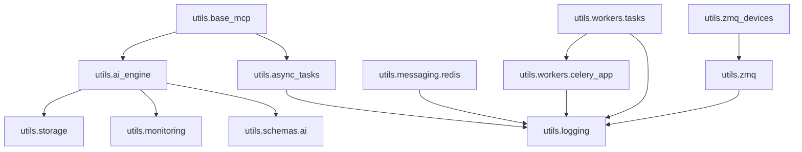
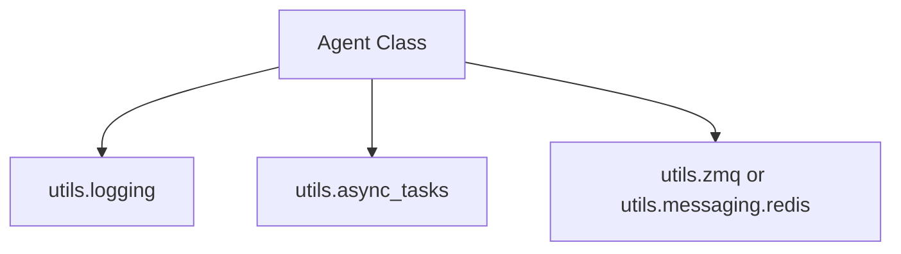
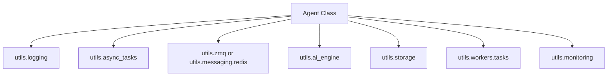
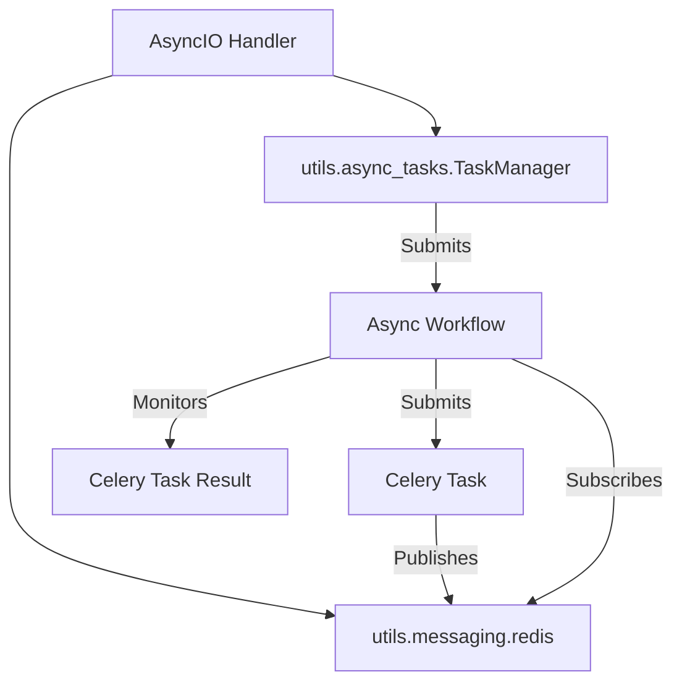
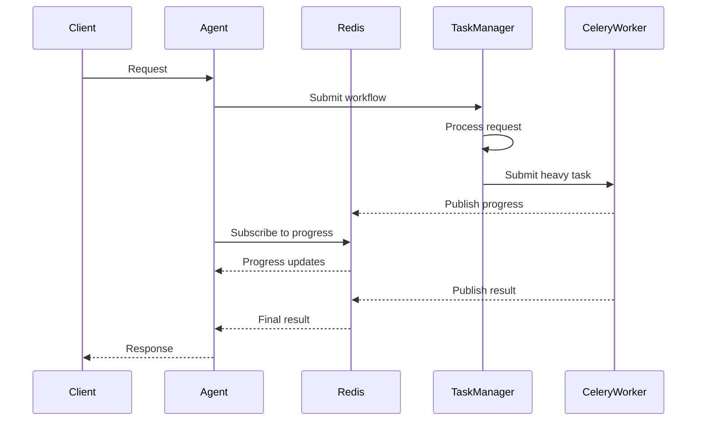
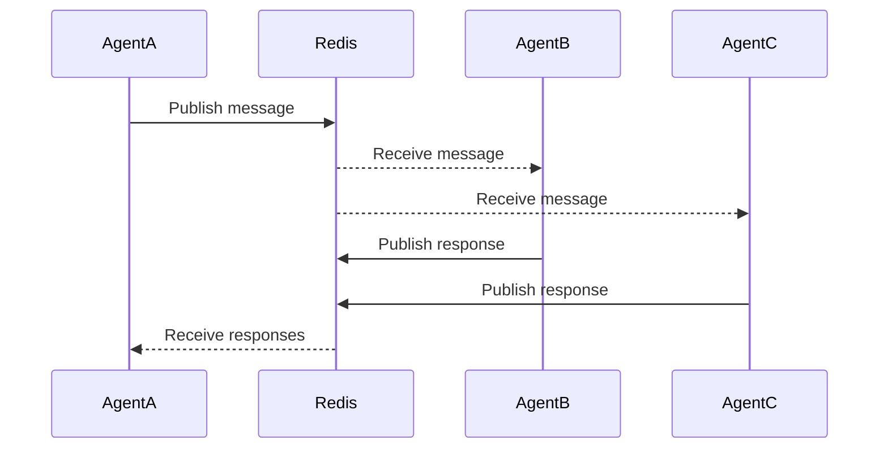

# Component Relationships

This document describes the relationships and dependencies between key components in the template-python-dev repository. Understanding these relationships will help you navigate the codebase and make modifications without breaking existing functionality.

## Core Component Dependencies

The diagram below illustrates the primary component dependencies:

## Detailed Relationships

### AI Engine and Dependencies

- **`ailf.ai_engine`**:
  - Uses `ailf.storage` for caching and persisting model outputs
  - Uses `ailf.monitoring` for tracking API calls, tokens, and performance
  - Uses `ailf.schemas.ai` for structured inputs and outputs
  - Uses `ailf.logging` for logging operations

### Messaging Components

- **`ailf.zmq`**:
  - Uses `ailf.logging` for logging operations
  - Provides messaging primitives used by `ailf.zmq_devices`

- **`ailf.messaging.redis`**:
  - Uses `ailf.logging` for logging operations
  - Provides Redis clients used by examples and applications
  - Independent from ZMQ messaging (can be used separately)

### Task Management

- **`ailf.async_tasks`**:
  - Uses `ailf.logging` for logging operations
  - Independent from other components but often used with Redis for coordination

- **`ailf.workers.celery_app` and `ailf.workers.tasks`**:
  - Uses `ailf.logging` for logging operations
  - Often used with Redis as the broker/backend
  - Can be used independently from AsyncTasks but can also be coordinated with it

### Storage and Configuration

- **`ailf.storage`**:
  - Uses `ailf.gcs_config_stash` for GCS configuration when in cloud mode
  - Uses `ailf.schemas.storage` for validating storage configurations
  - Uses `ailf.logging` for logging operations

- **`ailf.setup_storage`**:
  - Uses `ailf.storage` for initializing storage structures
  - Used during application startup

### MCP Server Components

- **`ailf.base_mcp`**:
  - Uses `ailf.ai_engine` for processing AI requests
  - Uses `ailf.async_tasks` for async task management
  - Uses `ailf.schemas.mcp` for defining MCP message structures
  - Uses `ailf.logging` for logging operations

## Integration Patterns

### Basic Agent Pattern

Most basic agents follow this dependency pattern:

### Full-Featured Agent Pattern

More complex agents typically include these dependencies:

### Coordination between AsyncIO and Celery

The common pattern for coordinating AsyncIO tasks with Celery:

## Extension Guidelines

When extending the components in this repository:

1. **Extending AI Engine**:
   - Subclass `AIEngine` to customize provider handling or add features
   - Override protected methods like `_setup_provider` rather than changing core logic

2. **Adding New Redis Patterns**:
   - Build on top of `AsyncRedisClient` or `RedisClient`
   - Follow existing patterns from `RedisPubSub` and `RedisStream`

3. **Creating Custom Task Flows**:
   - Use `TaskManager` for managing AsyncIO tasks
   - Use `Celery` tasks for CPU-bound or long-running operations
   - Use Redis to coordinate between components

4. **Implementing New Storage Backends**:
   - Extend the base `StorageManager` class
   - Implement the required abstract methods

## Common Cross-Component Workflows

### Real-time Processing Workflow

### Distributed Agent Communication

## Important Considerations

1. **Resource Lifecycle**: All components with `.start()` methods should have corresponding `.stop()` methods that properly clean up resources.

2. **Connection Management**: Redis and database connections are managed explicitly and should be closed when no longer needed.

3. **Error Propagation**: Error handling follows consistent patterns with appropriate logging and clean propagation to callers.

4. **Context Management**: APIs that require resource management are implemented as async context managers when appropriate.

5. **Configuration Separation**: Component behavior is configurable through constructor parameters rather than global state.
